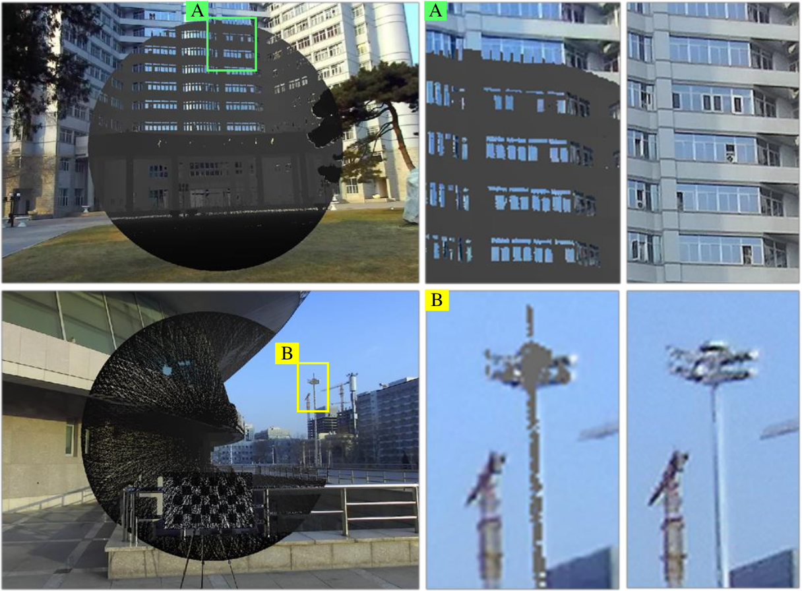
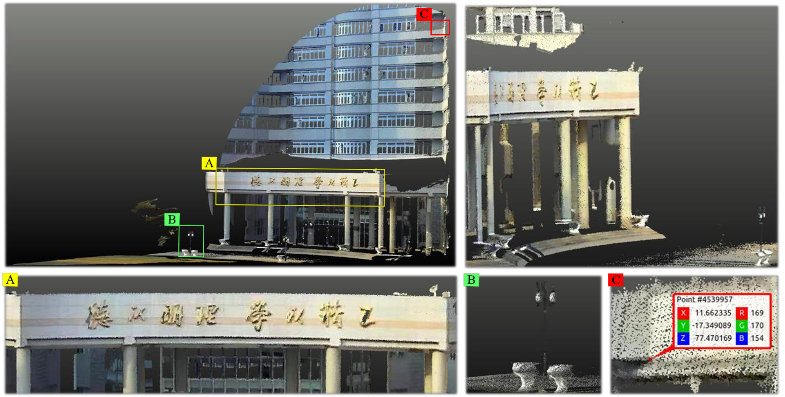
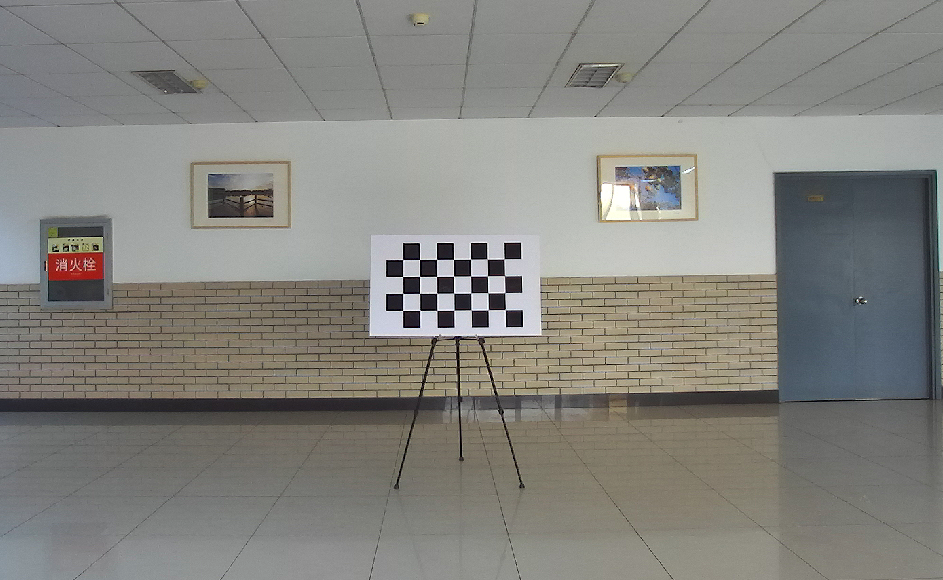
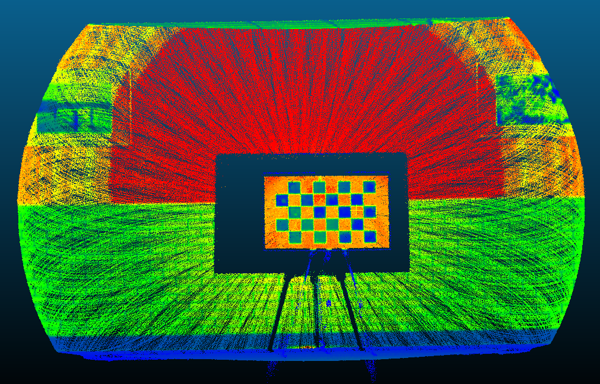
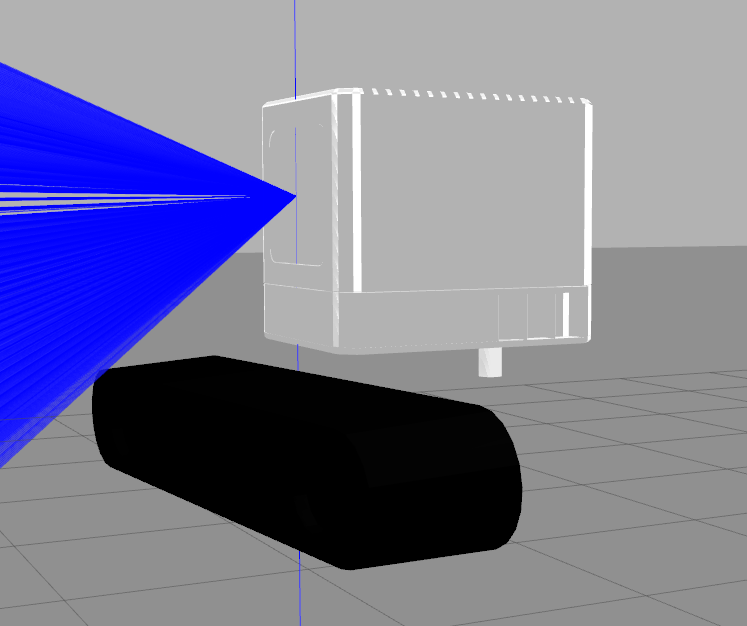
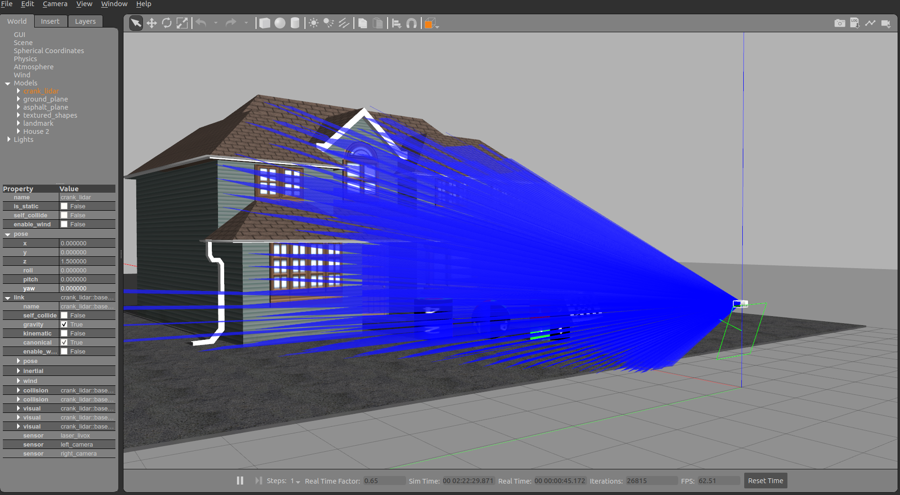
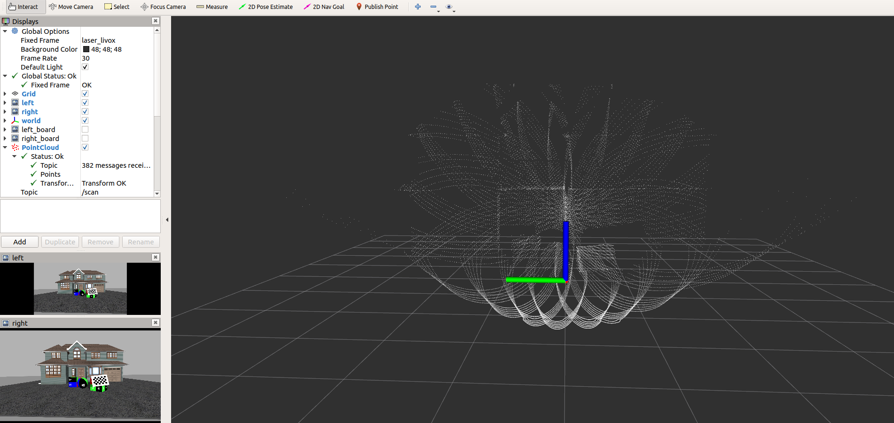
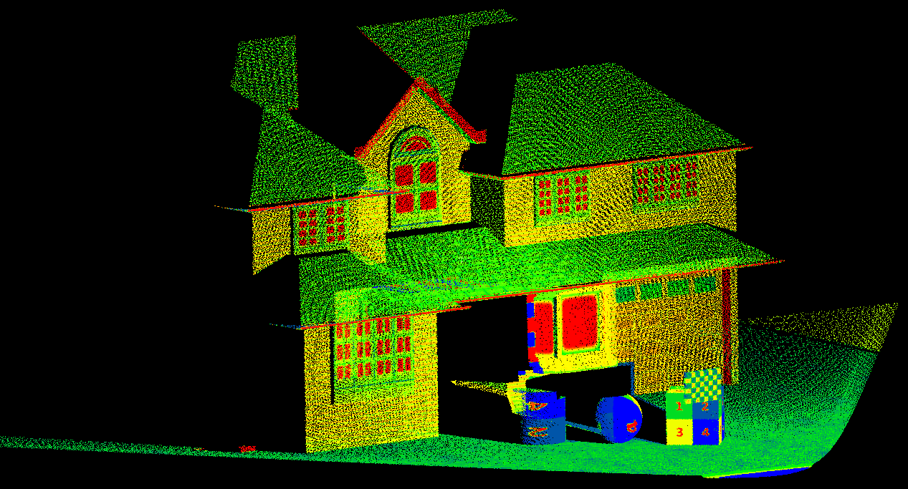

# Livox-LiDAR-Camera Calibrator

In this repository, we aim to build a high-precision automatic calibration tool for Livox-LiDAR-Camera system using a printed chessboard.

## Paper

For non-commercial research use. Please cite our Optics Express paper when use it, and it can be downloaded  [here](https://opg.optica.org/oe/viewmedia.cfm?uri=oe-30-10-16242&seq=0):

> 		@article{RCLC,
> 		author = {Zhengchao Lai and Yue Wang and Shangwei Guo and Xiantong Meng and Jun Li and Wenhao Li and Shaokun Han}
> 		number = {10},
> 		pages = {16242--16263},
> 		publisher = {OSA},
> 		title = {Laser reflectance feature assisted accurate extrinsic calibration for non-repetitive scanning LiDAR and camera systems},
> 		volume = {30},
> 		month = {May},
> 		year = {2022},
> 		url = {http://opg.optica.org/oe/abstract.cfm?URI=oe-30-10-16242},
> 		doi = {10.1364/OE.453449}
> 		}

## Calibration results

- Grid fitting process:

  

- Reproject results: point cloud to image ( more than 100m distance, toward pixel-wise align precision ):

  

- Reproject results: image pixel map to point clouds:

  

## Realworld Datasets
Indoor and outdoor calibration data for MID-40 and Zed2 system can be downloded at [GoogleDrive](https://drive.google.com/drive/folders/1zLcwRlwguh5txwxgK075HkXIG-hlaE5V?usp=sharing)  

## Requirements
- PCL (>1.7)
- Eigen3(3.3.4)
- OpenCV (>3.0)
- ceres

## Usage

- Configure `data_root_path` to be the data path in file **`config_real.yaml`**.

- build project:

  ` mkdir build && cd build `

  `cmake .. && make` 

- Segment the chessboard from pointcloud.

  `./BoardSegmentation`

- Start calibrate and show the results.

  `./Calibrate`

## Simulated Datasets

The complete code of simulation tool has been uploaded to   [Livox_Cam_Simulator](https://github.com/zhijianglu/Livox_Cam_Simulator.git). Some result as shown in the following figures.

- The scan model of Livox LiDAR:

  

- The zed camera combined with Livox LiDAR:

  

- The Gazebo scene:

   

- The rviz visulation:

   
  
    

Point clouds with reflectance intensity which mapped according to the color of the materials:

 

